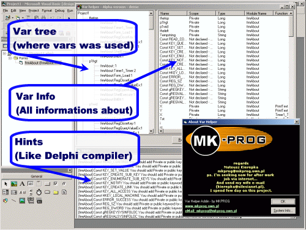



## VarHelper Alpha 2

### Description

This is second version of VarHelper Addin. Becouse 3 people give previuos version 5 balls ;) I repair some bugs, and add some futures.

Now its work better, and I think maybe in few weeks I can make final version.

Please Vote for this code!

In this code You can see how:

- make addin,

- make report in XML,

- use regullar expressions,

- fast collections (thanks Edanmo's!),

- make splitter with progress

- use and sort list view and tree

See and vote :)
 
### More Info
 
Visual Basic Code

how to add reference to XML engine (2.6 version is latest), how to add this addin: 1) compile to dll and register it. 2) In Addin Manager load it.

XML report

Hints

1) Not all is finished yet - some times it could report wrong variables.

2) My poor english ;)

             |
---                |---
**Submitted On**   |2001-04-06 12:05:48
**By**             |[Mateusz Kierepka](https://github.com/Planet-Source-Code/PSCIndex/blob/master/ByAuthor/mateusz-kierepka.md)
**Level**          |Intermediate
**User Rating**    |5.0 (35 globes from 7 users)
**Compatibility**  |VB 5\.0, VB 6\.0
**Category**       |[VB function enhancement](https://github.com/Planet-Source-Code/PSCIndex/blob/master/ByCategory/vb-function-enhancement__1-25.md)
**World**          |[Visual Basic](https://github.com/Planet-Source-Code/PSCIndex/blob/master/ByWorld/visual-basic.md)
**Archive File**   |[VarHelper 17995462001\.zip](https://github.com/Planet-Source-Code/mateusz-kierepka-varhelper-alpha-2__1-22181/archive/master.zip)

